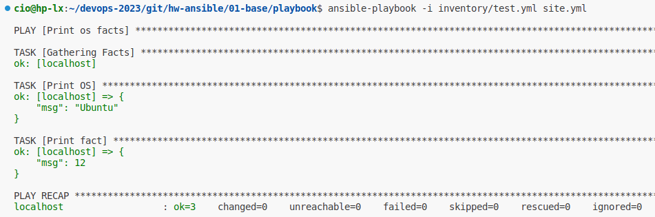
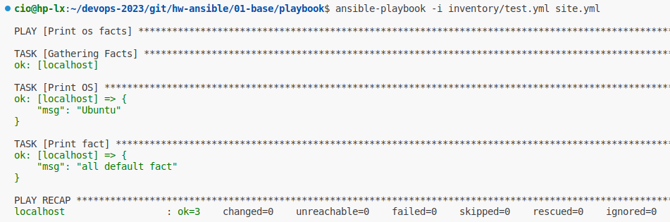
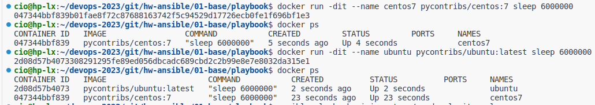
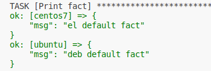
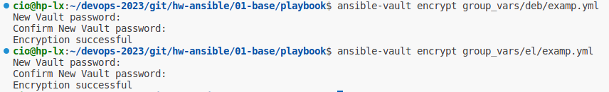
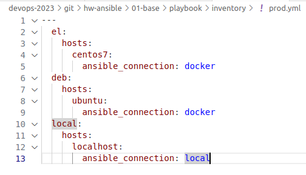
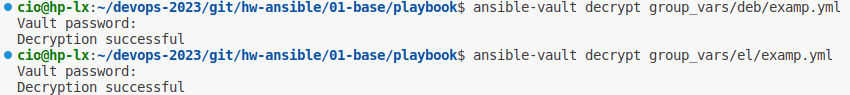
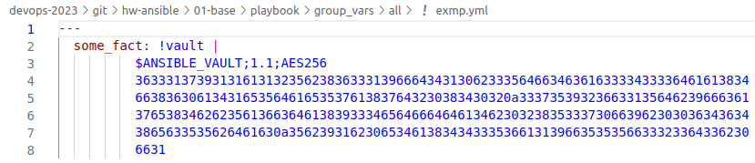
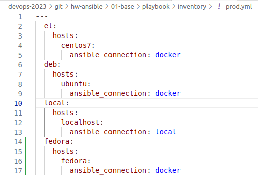
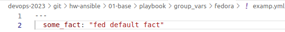

# Домашнее задание к занятию 1 «Введение в Ansible»

## Основная часть

1. Попробуйте запустить playbook на окружении из test.yml, зафиксируйте значение, которое имеет факт some_fact для указанного хоста при выполнении playbook.
   

2. Найдите файл с переменными (group_vars), в котором задаётся найденное в первом пункте значение, и поменяйте его на all default fact.
   

3. Воспользуйтесь подготовленным (используется docker) или создайте собственное окружение для проведения дальнейших испытаний.
   
   
4. Проведите запуск playbook на окружении из prod.yml. Зафиксируйте полученные значения some_fact для каждого из managed host.

```markdown
cio@hp-lx:~/devops-2023/git/hw-ansible/01-base/playbook$ ansible-playbook -i inventory/prod.yml site.yml

PLAY [Print os facts] ********************************************************************************************************************************************************************

TASK [Gathering Facts] *******************************************************************************************************************************************************************
ok: [ubuntu]
ok: [centos7]

TASK [Print OS] **************************************************************************************************************************************************************************
ok: [centos7] => {
    "msg": "CentOS"
}
ok: [ubuntu] => {
    "msg": "Ubuntu"
}

TASK [Print fact] ************************************************************************************************************************************************************************
ok: [centos7] => {
    "msg": "el"
}
ok: [ubuntu] => {
    "msg": "deb"
}

PLAY RECAP *******************************************************************************************************************************************************************************
centos7                    : ok=3    changed=0    unreachable=0    failed=0    skipped=0    rescued=0    ignored=0   
ubuntu                     : ok=3    changed=0    unreachable=0    failed=0    skipped=0    rescued=0    ignored=0  
```
5. Добавьте факты в group_vars каждой из групп хостов так, чтобы для some_fact получились значения: для deb — deb default fact, для el — el default fact.
   
   
6. Повторите запуск playbook на окружении prod.yml. Убедитесь, что выдаются корректные значения для всех хостов.

```markdown
cio@hp-lx:~/devops-2023/git/hw-ansible/01-base/playbook$ ansible-playbook -i inventory/test.yml site.yml

PLAY [Print os facts] ********************************************************************************************************************************************************************

TASK [Gathering Facts] *******************************************************************************************************************************************************************
ok: [localhost]

TASK [Print OS] **************************************************************************************************************************************************************************
ok: [localhost] => {
    "msg": "Ubuntu"
}

TASK [Print fact] ************************************************************************************************************************************************************************
ok: [localhost] => {
    "msg": "all default fact"
}

PLAY RECAP *******************************************************************************************************************************************************************************
localhost                  : ok=3    changed=0    unreachable=0    failed=0    skipped=0    rescued=0    ignored=0   

cio@hp-lx:~/devops-2023/git/hw-ansible/01-base/playbook$ ansible-playbook -i inventory/prod.yml site.yml

PLAY [Print os facts] ********************************************************************************************************************************************************************

TASK [Gathering Facts] *******************************************************************************************************************************************************************
ok: [ubuntu]
ok: [centos7]

TASK [Print OS] **************************************************************************************************************************************************************************
ok: [centos7] => {
    "msg": "CentOS"
}
ok: [ubuntu] => {
    "msg": "Ubuntu"
}

TASK [Print fact] ************************************************************************************************************************************************************************
ok: [centos7] => {
    "msg": "el default fact"
}
ok: [ubuntu] => {
    "msg": "deb default fact"
}

PLAY RECAP *******************************************************************************************************************************************************************************
centos7                    : ok=3    changed=0    unreachable=0    failed=0    skipped=0    rescued=0    ignored=0   
ubuntu                     : ok=3    changed=0    unreachable=0    failed=0    skipped=0    rescued=0    ignored=0 
```
7. При помощи ansible-vault зашифруйте факты в group_vars/deb и group_vars/el с паролем netology.
   
   
8. Запустите playbook на окружении prod.yml. При запуске ansible должен запросить у вас пароль. Убедитесь в работоспособности.

```markdown
cio@hp-lx:~/devops-2023/git/hw-ansible/01-base/playbook$ ansible-playbook -i inventory/prod.yml site.yml

PLAY [Print os facts] ********************************************************************************************************************************************************************
ERROR! Attempting to decrypt but no vault secrets found

cio@hp-lx:~/devops-2023/git/hw-ansible/01-base/playbook$ ansible-playbook -i inventory/prod.yml site.yml --ask-vault-password
Vault password: 

PLAY [Print os facts] ********************************************************************************************************************************************************************

TASK [Gathering Facts] *******************************************************************************************************************************************************************
ok: [ubuntu]
ok: [centos7]

TASK [Print OS] **************************************************************************************************************************************************************************
ok: [centos7] => {
    "msg": "CentOS"
}
ok: [ubuntu] => {
    "msg": "Ubuntu"
}

TASK [Print fact] ************************************************************************************************************************************************************************
ok: [centos7] => {
    "msg": "el default fact"
}
ok: [ubuntu] => {
    "msg": "deb default fact"
}

PLAY RECAP *******************************************************************************************************************************************************************************
centos7                    : ok=3    changed=0    unreachable=0    failed=0    skipped=0    rescued=0    ignored=0   
ubuntu                     : ok=3    changed=0    unreachable=0    failed=0    skipped=0    rescued=0    ignored=0 
```
9.  Посмотрите при помощи ansible-doc список плагинов для подключения. Выберите подходящий для работы на control node.
* подключаем плагин <b>local<b>

10. В prod.yml добавьте новую группу хостов с именем local, в ней разместите localhost с необходимым типом подключения.



11. Запустите playbook на окружении prod.yml. При запуске ansible должен запросить у вас пароль. Убедитесь, что факты some_fact для каждого из хостов определены из верных group_vars.

 ```markdown
 cio@hp-lx:~/devops-2023/git/hw-ansible/01-base/playbook$ ansible-playbook -i inventory/prod.yml site.yml --ask-vault-password
Vault password: 

PLAY [Print os facts] ********************************************************************************************************************************************************************

TASK [Gathering Facts] *******************************************************************************************************************************************************************
ok: [localhost]
ok: [ubuntu]
ok: [centos7]

TASK [Print OS] **************************************************************************************************************************************************************************
ok: [centos7] => {
    "msg": "CentOS"
}
ok: [ubuntu] => {
    "msg": "Ubuntu"
}
ok: [localhost] => {
    "msg": "Ubuntu"
}

TASK [Print fact] ************************************************************************************************************************************************************************
ok: [centos7] => {
    "msg": "el default fact"
}
ok: [ubuntu] => {
    "msg": "deb default fact"
}
ok: [localhost] => {
    "msg": "all default fact"
}

PLAY RECAP *******************************************************************************************************************************************************************************
centos7                    : ok=3    changed=0    unreachable=0    failed=0    skipped=0    rescued=0    ignored=0   
localhost                  : ok=3    changed=0    unreachable=0    failed=0    skipped=0    rescued=0    ignored=0   
ubuntu                     : ok=3    changed=0    unreachable=0    failed=0    skipped=0    rescued=0    ignored=0 
 ```
## Необязательная часть

1. При помощи ansible-vault расшифруйте все зашифрованные файлы с переменными.
   
2. Зашифруйте отдельное значение PaSSw0rd для переменной some_fact паролем netology. Добавьте полученное значение в group_vars/all/exmp.yml.
   
3. Запустите playbook, убедитесь, что для нужных хостов применился новый fact.
   ```markdown
   cio@hp-lx:~/devops-2023/git/hw-ansible/01-base/playbook$ ansible-playbook -i inventory/prod.yml site.yml --ask-vault-password
    Vault password: 

    PLAY [Print os facts] ********************************************************************************************************************************************************

    TASK [Gathering Facts] *******************************************************************************************************************************************************
    ok: [localhost]
    ok: [ubuntu]
    ok: [centos7]

    TASK [Print OS] **************************************************************************************************************************************************************
    ok: [centos7] => {
        "msg": "CentOS"
    }
    ok: [ubuntu] => {
        "msg": "Ubuntu"
    }
    ok: [localhost] => {
        "msg": "Ubuntu"
    }

    TASK [Print fact] ************************************************************************************************************************************************************
    ok: [centos7] => {
        "msg": "el default fact"
    }
    ok: [ubuntu] => {
        "msg": "deb default fact"
    }
    ok: [localhost] => {
        "msg": "PaSSw0rd"
    }

    PLAY RECAP *******************************************************************************************************************************************************************
    centos7                    : ok=3    changed=0    unreachable=0    failed=0    skipped=0    rescued=0    ignored=0   
    localhost                  : ok=3    changed=0    unreachable=0    failed=0    skipped=0    rescued=0    ignored=0   
    ubuntu                     : ok=3    changed=0    unreachable=0    failed=0    skipped=0    rescued=0    ignored=0  
   ```
4. Добавьте новую группу хостов fedora, самостоятельно придумайте для неё переменную. В качестве образа можно использовать этот вариант.
   * загрузка образа
        ```markdown
        cio@hp-lx:~/devops-2023/git/hw-ansible/01-base/playbook$ docker run -d -t --name fedora pycontribs/fedora
        Unable to find image 'pycontribs/fedora:latest' locally
        latest: Pulling from pycontribs/fedora
        588cf1704268: Pull complete 
        49425a0e12c7: Pull complete 
        Digest: sha256:20eeb45ef6e394947058dc24dc2bd98dfb7a8fecbbe6363d14ab3170f10a27ab
        Status: Downloaded newer image for pycontribs/fedora:latest
        4e17b34251a5dabde5c56e33c1c175a278e0c2049e1b735dde31b990c2045406
        cio@hp-lx:~/devops-2023/git/hw-ansible/01-base/playbook$ docker ps
        CONTAINER ID   IMAGE                      COMMAND           CREATED         STATUS         PORTS     NAMES
        4e17b34251a5   pycontribs/fedora          "/bin/bash"       3 seconds ago   Up 2 seconds             fedora
        2d08d57b4073   pycontribs/ubuntu:latest   "sleep 6000000"   11 hours ago    Up 9 minutes             ubuntu
        047344bbf839   pycontribs/centos:7        "sleep 6000000"   11 hours ago    Up 9 minutes             centos7
        ```
    * Добавляем новую группу хостов:
      
    * добавляем файл с переменной:
    
    * Итог работы playbook:
    ```markdown
    cio@hp-lx:~/devops-2023/git/hw-ansible/01-base/playbook$ ansible-playbook site.yml -i inventory/prod.yml --ask-vault-password
    Vault password: 
    [WARNING]: Found both group and host with same name: fedora

    PLAY [Print os facts] ********************************************************************************************************************************************************

    TASK [Gathering Facts] *******************************************************************************************************************************************************
    ok: [localhost]
    ok: [fedora]
    ok: [ubuntu]
    ok: [centos7]

    TASK [Print OS] **************************************************************************************************************************************************************
    ok: [centos7] => {
        "msg": "CentOS"
    }
    ok: [ubuntu] => {
        "msg": "Ubuntu"
    }
    ok: [localhost] => {
        "msg": "Ubuntu"
    }
    ok: [fedora] => {
        "msg": "Fedora"
    }

    TASK [Print fact] ************************************************************************************************************************************************************
    ok: [centos7] => {
        "msg": "el default fact"
    }
    ok: [ubuntu] => {
        "msg": "deb default fact"
    }
    ok: [fedora] => {
        "msg": "fed default fact"
    }
    ok: [localhost] => {
        "msg": "PaSSw0rd"
    }

    PLAY RECAP *******************************************************************************************************************************************************************
    centos7                    : ok=3    changed=0    unreachable=0    failed=0    skipped=0    rescued=0    ignored=0   
    fedora                     : ok=3    changed=0    unreachable=0    failed=0    skipped=0    rescued=0    ignored=0   
    localhost                  : ok=3    changed=0    unreachable=0    failed=0    skipped=0    rescued=0    ignored=0   
    ubuntu                     : ok=3    changed=0    unreachable=0    failed=0    skipped=0    rescued=0    ignored=0 
    ```

