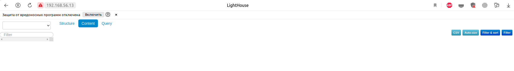
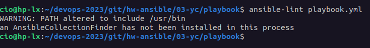

# Домашнее задание к занятию 3 «Использование Ansible»

## Подготовка к выполнению

1. Подготовьте в Yandex Cloud три хоста: для `clickhouse`, для `vector` и для `lighthouse`.
2. Репозиторий LightHouse находится [по ссылке](https://github.com/VKCOM/lighthouse).

## Основная часть

1. Допишите playbook: нужно сделать ещё один play, который устанавливает и настраивает LightHouse.
2. При создании tasks рекомендую использовать модули: `get_url`, `template`, `yum`, `apt`.
3. Tasks должны: скачать статику LightHouse, установить Nginx или любой другой веб-сервер, настроить его конфиг для открытия LightHouse, запустить веб-сервер.
   

         - name: Install lighthouse
           hosts: lighthouse
           become: true

           handlers:
             - name: nginx-reload
               ansible.builtin.service:
                 name: nginx
                 state: restarted

           tasks:
             - name: Install nginx
               ansible.builtin.apt:
                 name: nginx
                 state: present

             - name: Get lighthouse from git
               ansible.builtin.git:
                 repo: "{{ lighthouse_repo }}"
                 version: master
                 dest: "{{ lighthouse_dst_folder }}"

             - name: Make website avaliable
               tags: config
               ansible.builtin.template:
                 src: lighthouse.conf.j2
                 dest: "/etc/nginx/sites-enabled/default"
                 mode: 0644
               notify: nginx-reload

             - name: Flush handllush_handleers
               meta: flush_handlers


4. Подготовьте свой inventory-файл `prod.yml`.
   
    all:
      children:
        clickhouse:
          hosts:
            server.clickhouse.vagrant:
              ansible_host: 192.168.56.12
              ansible_connection: ssh
              ansible_user: vagrant
        lighthouse:
          hosts:
            server.lighthouse.vagrant:
              ansible_host: 192.168.56.13
              ansible_connection: ssh
              ansible_user: vagrant
        vector:
          hosts:
            server.vector.vagrant:
              ansible_host: 192.168.56.11
              ansible_connection: ssh
              ansible_user: vagrant
              
              
5. Запустите `ansible-lint site.yml` и исправьте ошибки, если они есть.



6. Попробуйте запустить playbook на этом окружении с флагом `--check`.
   
    cio@hp-lx:~/devops-2023/git/hw-ansible/03-yc/playbook$ ansible-playbook -i inventory/prod.yml playbook.yml --check

    PLAY [base packages] *********************************************************************************************************************************************************

    TASK [Gathering Facts] *******************************************************************************************************************************************************
    ok: [server.vector.vagrant]
    ok: [server.clickhouse.vagrant]
    ok: [server.lighthouse.vagrant]

    TASK [Installing tools] ******************************************************************************************************************************************************
    ok: [server.vector.vagrant] => (item=git)
    ok: [server.lighthouse.vagrant] => (item=git)
    ok: [server.clickhouse.vagrant] => (item=git)
    ok: [server.vector.vagrant] => (item=curl)
    ok: [server.lighthouse.vagrant] => (item=curl)
    ok: [server.clickhouse.vagrant] => (item=curl)
    ok: [server.vector.vagrant] => (item=wget)
    ok: [server.lighthouse.vagrant] => (item=wget)
    ok: [server.clickhouse.vagrant] => (item=wget)
    ok: [server.clickhouse.vagrant] => (item=unzip)
    ok: [server.vector.vagrant] => (item=unzip)
    ok: [server.lighthouse.vagrant] => (item=unzip)

    TASK [add ssh key] ***********************************************************************************************************************************************************
    ok: [server.vector.vagrant]
    ok: [server.clickhouse.vagrant]
    ok: [server.lighthouse.vagrant]

    PLAY [Install Clickhouse] ****************************************************************************************************************************************************

    TASK [Gathering Facts] *******************************************************************************************************************************************************
    ok: [server.clickhouse.vagrant]

    TASK [Get clickhouse distrib] ************************************************************************************************************************************************
    ok: [server.clickhouse.vagrant] => (item=clickhouse-client)
    ok: [server.clickhouse.vagrant] => (item=clickhouse-server)
    ok: [server.clickhouse.vagrant] => (item=clickhouse-common-static)

    TASK [Install clickhouse packages] *******************************************************************************************************************************************
    ok: [server.clickhouse.vagrant] => (item=clickhouse-common-static-22.4.6.53.deb)
    ok: [server.clickhouse.vagrant] => (item=clickhouse-client-22.4.6.53.deb)
    ok: [server.clickhouse.vagrant] => (item=clickhouse-server-22.4.6.53.deb)

    TASK [Flush handllush_handleers] *********************************************************************************************************************************************

    TASK [wait till clickhouse will be restarted] ********************************************************************************************************************************
    Pausing for 5 seconds
    (ctrl+C then 'C' = continue early, ctrl+C then 'A' = abort)
    ok: [server.clickhouse.vagrant]

    TASK [Create database] *******************************************************************************************************************************************************
    skipping: [server.clickhouse.vagrant]

    PLAY [Install Vector] ********************************************************************************************************************************************************

    TASK [Gathering Facts] *******************************************************************************************************************************************************
    ok: [server.vector.vagrant]

    TASK [Get Vector Package] ****************************************************************************************************************************************************
    ok: [server.vector.vagrant]

    PLAY [Install lighthouse] ****************************************************************************************************************************************************

    TASK [Gathering Facts] *******************************************************************************************************************************************************
    ok: [server.lighthouse.vagrant]

    TASK [Install nginx] *********************************************************************************************************************************************************
    ok: [server.lighthouse.vagrant]

    TASK [Get lighthouse from git] ***********************************************************************************************************************************************
    ok: [server.lighthouse.vagrant]

    TASK [Make website avaliable] ************************************************************************************************************************************************
    ok: [server.lighthouse.vagrant]

    TASK [Flush handllush_handleers] *********************************************************************************************************************************************

    PLAY RECAP *******************************************************************************************************************************************************************
    server.clickhouse.vagrant  : ok=7    changed=0    unreachable=0    failed=0    skipped=1    rescued=0    ignored=0   
    server.lighthouse.vagrant  : ok=7    changed=0    unreachable=0    failed=0    skipped=0    rescued=0    ignored=0   
    server.vector.vagrant      : ok=5    changed=0    unreachable=0    failed=0    skipped=0    rescued=0    ignored=0 
      
7. Запустите playbook на `prod.yml` окружении с флагом `--diff`. Убедитесь, что изменения на системе произведены.

```markdown
cio@hp-lx:~/devops-2023/git/hw-ansible/03-yc/playbook$ ansible-playbook -i inventory/prod.yml playbook.yml --diff

PLAY [base packages] *********************************************************************************************************************************************************

TASK [Gathering Facts] *******************************************************************************************************************************************************
ok: [server.clickhouse.vagrant]
ok: [server.lighthouse.vagrant]
ok: [server.vector.vagrant]

TASK [Installing tools] ******************************************************************************************************************************************************
ok: [server.vector.vagrant] => (item=git)
ok: [server.lighthouse.vagrant] => (item=git)
ok: [server.clickhouse.vagrant] => (item=git)
ok: [server.vector.vagrant] => (item=curl)
ok: [server.clickhouse.vagrant] => (item=curl)
ok: [server.lighthouse.vagrant] => (item=curl)
ok: [server.vector.vagrant] => (item=wget)
ok: [server.clickhouse.vagrant] => (item=wget)
ok: [server.lighthouse.vagrant] => (item=wget)
ok: [server.vector.vagrant] => (item=unzip)
ok: [server.lighthouse.vagrant] => (item=unzip)
ok: [server.clickhouse.vagrant] => (item=unzip)

TASK [add ssh key] ***********************************************************************************************************************************************************
ok: [server.vector.vagrant]
ok: [server.lighthouse.vagrant]
ok: [server.clickhouse.vagrant]

PLAY [Install Clickhouse] ****************************************************************************************************************************************************

TASK [Gathering Facts] *******************************************************************************************************************************************************
ok: [server.clickhouse.vagrant]

TASK [Get clickhouse distrib] ************************************************************************************************************************************************
ok: [server.clickhouse.vagrant] => (item=clickhouse-client)
ok: [server.clickhouse.vagrant] => (item=clickhouse-server)
ok: [server.clickhouse.vagrant] => (item=clickhouse-common-static)

TASK [Install clickhouse packages] *******************************************************************************************************************************************
ok: [server.clickhouse.vagrant] => (item=clickhouse-common-static-22.4.6.53.deb)
ok: [server.clickhouse.vagrant] => (item=clickhouse-client-22.4.6.53.deb)
ok: [server.clickhouse.vagrant] => (item=clickhouse-server-22.4.6.53.deb)

TASK [Flush handllush_handleers] *********************************************************************************************************************************************

TASK [wait till clickhouse will be restarted] ********************************************************************************************************************************
Pausing for 5 seconds
(ctrl+C then 'C' = continue early, ctrl+C then 'A' = abort)
ok: [server.clickhouse.vagrant]

TASK [Create database] *******************************************************************************************************************************************************
ok: [server.clickhouse.vagrant]

PLAY [Install Vector] ********************************************************************************************************************************************************

TASK [Gathering Facts] *******************************************************************************************************************************************************
ok: [server.vector.vagrant]

TASK [Get Vector Package] ****************************************************************************************************************************************************
ok: [server.vector.vagrant]

PLAY [Install lighthouse] ****************************************************************************************************************************************************

TASK [Gathering Facts] *******************************************************************************************************************************************************
ok: [server.lighthouse.vagrant]

TASK [Install nginx] *********************************************************************************************************************************************************
ok: [server.lighthouse.vagrant]

TASK [Get lighthouse from git] ***********************************************************************************************************************************************
ok: [server.lighthouse.vagrant]

TASK [Make website avaliable] ************************************************************************************************************************************************
ok: [server.lighthouse.vagrant]

TASK [Flush handllush_handleers] *********************************************************************************************************************************************

PLAY RECAP *******************************************************************************************************************************************************************
server.clickhouse.vagrant  : ok=8    changed=0    unreachable=0    failed=0    skipped=0    rescued=0    ignored=0   
server.lighthouse.vagrant  : ok=7    changed=0    unreachable=0    failed=0    skipped=0    rescued=0    ignored=0   
server.vector.vagrant      : ok=5    changed=0    unreachable=0    failed=0    skipped=0    rescued=0    ignored=0  
```

8. Повторно запустите playbook с флагом `--diff` и убедитесь, что playbook идемпотентен.

```markdown
cio@hp-lx:~/devops-2023/git/hw-ansible/03-yc/playbook$ ansible-playbook -i inventory/prod.yml playbook.yml --diff

PLAY [base packages] *********************************************************************************************************************************************************

TASK [Gathering Facts] *******************************************************************************************************************************************************
ok: [server.clickhouse.vagrant]
ok: [server.lighthouse.vagrant]
ok: [server.vector.vagrant]

TASK [Installing tools] ******************************************************************************************************************************************************
ok: [server.vector.vagrant] => (item=git)
ok: [server.clickhouse.vagrant] => (item=git)
ok: [server.lighthouse.vagrant] => (item=git)
ok: [server.vector.vagrant] => (item=curl)
ok: [server.lighthouse.vagrant] => (item=curl)
ok: [server.clickhouse.vagrant] => (item=curl)
ok: [server.lighthouse.vagrant] => (item=wget)
ok: [server.vector.vagrant] => (item=wget)
ok: [server.clickhouse.vagrant] => (item=wget)
ok: [server.lighthouse.vagrant] => (item=unzip)
ok: [server.vector.vagrant] => (item=unzip)
ok: [server.clickhouse.vagrant] => (item=unzip)

TASK [add ssh key] ***********************************************************************************************************************************************************
ok: [server.lighthouse.vagrant]
ok: [server.clickhouse.vagrant]
ok: [server.vector.vagrant]

PLAY [Install Clickhouse] ****************************************************************************************************************************************************

TASK [Gathering Facts] *******************************************************************************************************************************************************
ok: [server.clickhouse.vagrant]

TASK [Get clickhouse distrib] ************************************************************************************************************************************************
ok: [server.clickhouse.vagrant] => (item=clickhouse-client)
ok: [server.clickhouse.vagrant] => (item=clickhouse-server)
ok: [server.clickhouse.vagrant] => (item=clickhouse-common-static)

TASK [Install clickhouse packages] *******************************************************************************************************************************************
ok: [server.clickhouse.vagrant] => (item=clickhouse-common-static-22.4.6.53.deb)
ok: [server.clickhouse.vagrant] => (item=clickhouse-client-22.4.6.53.deb)
ok: [server.clickhouse.vagrant] => (item=clickhouse-server-22.4.6.53.deb)

TASK [Flush handllush_handleers] *********************************************************************************************************************************************

TASK [wait till clickhouse will be restarted] ********************************************************************************************************************************
Pausing for 5 seconds
(ctrl+C then 'C' = continue early, ctrl+C then 'A' = abort)
ok: [server.clickhouse.vagrant]

TASK [Create database] *******************************************************************************************************************************************************
ok: [server.clickhouse.vagrant]

PLAY [Install Vector] ********************************************************************************************************************************************************

TASK [Gathering Facts] *******************************************************************************************************************************************************
ok: [server.vector.vagrant]

TASK [Get Vector Package] ****************************************************************************************************************************************************
ok: [server.vector.vagrant]

PLAY [Install lighthouse] ****************************************************************************************************************************************************

TASK [Gathering Facts] *******************************************************************************************************************************************************
ok: [server.lighthouse.vagrant]

TASK [Install nginx] *********************************************************************************************************************************************************
ok: [server.lighthouse.vagrant]

TASK [Get lighthouse from git] ***********************************************************************************************************************************************
ok: [server.lighthouse.vagrant]

TASK [Make website avaliable] ************************************************************************************************************************************************
ok: [server.lighthouse.vagrant]

TASK [Flush handllush_handleers] *********************************************************************************************************************************************

PLAY RECAP *******************************************************************************************************************************************************************
server.clickhouse.vagrant  : ok=8    changed=0    unreachable=0    failed=0    skipped=0    rescued=0    ignored=0   
server.lighthouse.vagrant  : ok=7    changed=0    unreachable=0    failed=0    skipped=0    rescued=0    ignored=0   
server.vector.vagrant      : ok=5    changed=0    unreachable=0    failed=0    skipped=0    rescued=0    ignored=0 
```

