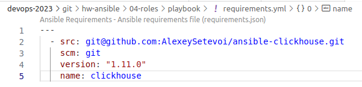
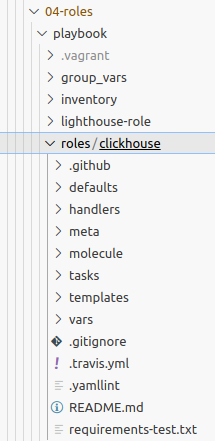
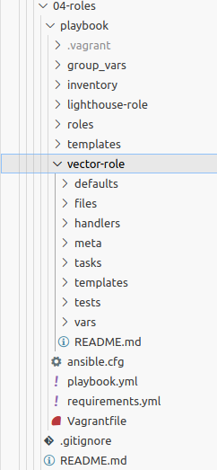

# Домашнее задание к занятию 4 «Работа с roles»

1. Создайте в старой версии playbook файл `requirements.yml` и заполните его содержимым:

   ```yaml
   ---
     - src: git@github.com:AlexeySetevoi/ansible-clickhouse.git
       scm: git
       version: "1.13"
       name: clickhouse 
   ```
    #### Решение:

    

2. При помощи `ansible-galaxy` скачайте себе эту роль.
   #### Решение:
   
   
3. Создайте новый каталог с ролью при помощи `ansible-galaxy role init vector-role`.
    #### Решение:
    
4. На основе tasks из старого playbook заполните новую role. Разнесите переменные между `vars` и `default`. 
    ```markdown
    - name: Install Vector
      hosts: vector
      roles:
        - role: vector-role
          vector_version: "0.30.0"
    ```
5. Перенести нужные шаблоны конфигов в `templates`.
6. Опишите в `README.md` обе роли и их параметры:
   * [lighthouse-role](https://github.com/VladimirKru/hw-ansible/tree/main/lighthouse-role)
   * [vector-role](https://github.com/VladimirKru/hw-ansible/tree/main/vector-role)
7. Повторите шаги 3–6 для LightHouse. Помните, что одна роль должна настраивать один продукт.
8. Добавьте roles в `requirements.yml` в playbook.
  
    ```markdown
      - src: git@github.com:VladimirKru/lighthouse-role.git
        scm: git
        version: "0.30.0"
        name: vector

      - src: git@github.com:VladimirKru/lighthouse-role.git
        scm: git
        version: latest
        name: lighthouse
    ```

9.  Переработайте playbook на использование roles. Не забудьте про зависимости LightHouse и возможности совмещения `roles` с `tasks`.
10.  Выложите playbook в репозиторий.
11. В ответе дайте ссылки на оба репозитория с roles и одну ссылку на репозиторий с playbook:
    1.  [lighthouse-role](https://github.com/VladimirKru/hw-ansible/tree/main/lighthouse-role)
    2.  [vector-role](https://github.com/VladimirKru/hw-ansible/tree/main/vector-role)
    3.  [playbook](https://github.com/VladimirKru/hw-ansible/tree/main/04-roles)
    

